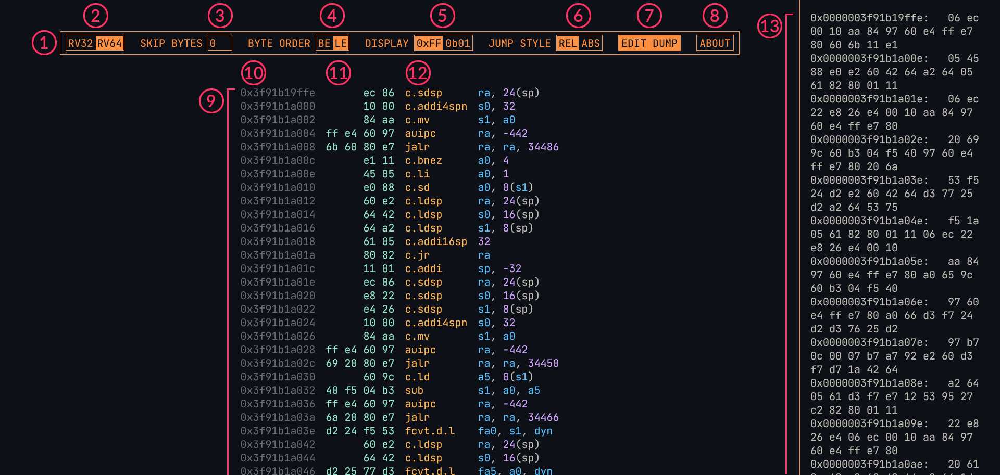

# Руководство пользователя RISCify

## Интерфейс



1. Панель управления
2. Переключение разрядности архитектуры
3. Пропуск первых байтов из дампа на случай, если дамп начинается с обрывка инструкции
4. Порядок байт как для вывода представления инструкций в дампе, так и для парсинга дампа, когда несколько байт идут подряд без пробелов
5. Переключение между HEX/BIN представлением (в бинарном при ховере по аргументам подсвечиваются их биты)
6. Относительные/Абсолютные смещения у инструкций потока управления
7. Вызов панели редактирования дампа
8. Показ информации
9. Дизассемблированный код
10. Адреса инструкций
11. Представление инструкций в дампе
12. Мнемоники инструкций с аргументами
13. Панель редактирования дампа (скрываемая)

## Поддерживаемые расширения

- `RV32/RV64`:
  - `G`
    - `I`
    - `A`
    - `M`
    - `F`
    - `D`
    - `Q`
    - `Zfh`
    - `Zawrs`
    - `Ziscr`
    - `Zifencei`
  - `C`
  - `B`

## Пример дампа

```
13 01 01 fe
23 2e 11 00
23 2c 81 00
13 04 01 02
23 26 a4 fe
23 24 b4 fe
83 27 84 fe
87 a7 07 00
53 07 00 f0
d3 a7 e7 a0
63 86 07 02
83 27 84 fe
93 87 47 00
87 a7 07 00
53 07 00 f0
d3 a7 e7 a0
63 86 07 00
93 07 f0 ff
6f 00 40 03
93 07 00 00
6f 00 c0 02
83 27 84 fe
93 87 47 00
87 a7 07 00
53 97 f7 20
83 27 84 fe
87 a7 07 00
d3 77 f7 18
83 27 c4 fe
27 a0 f7 00
93 07 10 00
13 85 07 00
83 20 c1 01
03 24 81 01
13 01 01 02
67 80 00 00
```
